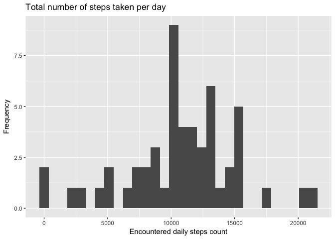
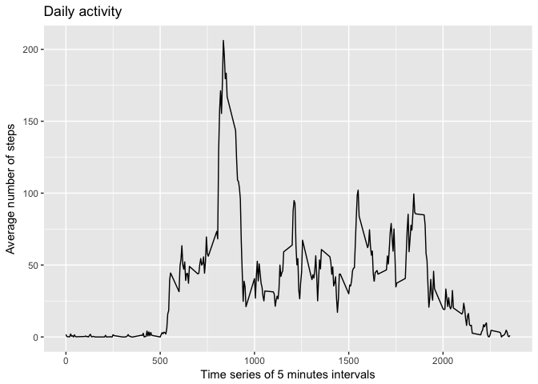
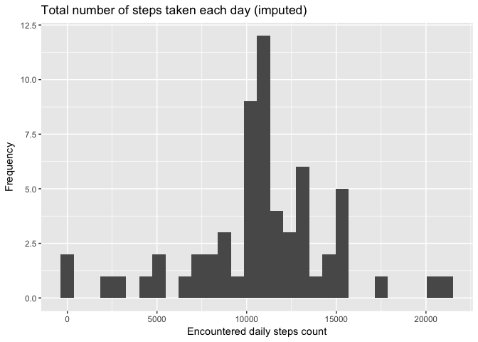
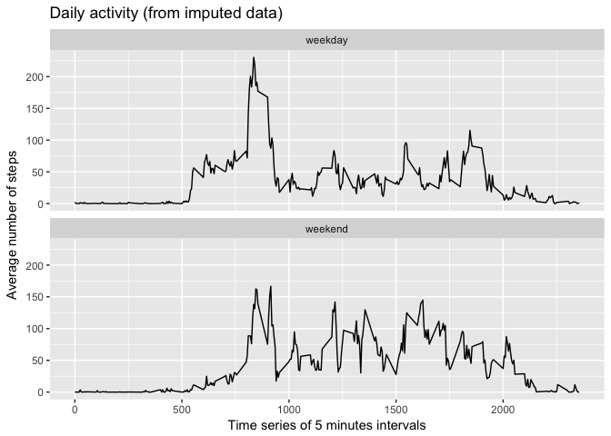

# Reproducible Research: Peer Assessment 1

This assignment makes use of data from a personal activity monitoring device. This device collects data at 5 minute intervals through out the day. The data consists of two months of data from an anonymous individual collected during the months of October and November, 2012 and include the number of steps taken in 5 minute intervals each day.

The data for this assignment can be downloaded from [here](https://d396qusza40orc.cloudfront.net/repdata%2Fdata%2Factivity.zip).

The variables included in this dataset are:

- **steps**: Number of steps taking in a 5-minute interval (missing values are coded as 𝙽𝙰)
- **date**: The date on which the measurement was taken in YYYY-MM-DD format
- **interval**: Identifier for the 5-minute interval in which measurement was taken

# Data preparation


```r
data <- read.csv("activity.csv", colClasses = c("integer", "Date", "integer"))
dim(data)
```

```
## [1] 17568     3
```


```r
head(data)
```

```
##   steps       date interval
## 1    NA 2012-10-01        0
## 2    NA 2012-10-01        5
## 3    NA 2012-10-01       10
## 4    NA 2012-10-01       15
## 5    NA 2012-10-01       20
## 6    NA 2012-10-01       25
```


```r
summary(data)
```

```
##      steps             date               interval     
##  Min.   :  0.00   Min.   :2012-10-01   Min.   :   0.0  
##  1st Qu.:  0.00   1st Qu.:2012-10-16   1st Qu.: 588.8  
##  Median :  0.00   Median :2012-10-31   Median :1177.5  
##  Mean   : 37.38   Mean   :2012-10-31   Mean   :1177.5  
##  3rd Qu.: 12.00   3rd Qu.:2012-11-15   3rd Qu.:1766.2  
##  Max.   :806.00   Max.   :2012-11-30   Max.   :2355.0  
##  NA's   :2304
```

Obviously missing values are located in the **steps** variable only.

The next steps of the analysis use a filtered version without NA's of the origin dataset.


```r
library(dplyr)
data.noNA <- data %>% filter(!is.na(steps))
```

## Exploratory analysis

As noticed during the preparation phase, the period of observation is from **2012-10-01** to **2012-11-30**.

### Total number of steps taken per day

The number of steps is summed per day. The following graph presents the frequency of the different sums over the period of observation.


```r
steps.by_day.sum <- summarise(group_by(data.noNA, date), steps = sum(steps))

library(ggplot2)
ggplot(steps.by_day.sum, aes(x = steps)) +
    geom_histogram() +
    labs(title = "Total number of steps taken per day") +
    labs(x = "Encountered daily steps count", y="Frequency")
```

<!-- -->

The next table contains the mean and the median of the total number of steps taken per day, applied on the filtered data:


```r
steps.summary <- steps.by_day.sum %>%
    summarise(steps.mean = mean(steps), steps.median = median(steps))

cbind(data=factor(c("filtered")), steps.summary)
```

```
##       data steps.mean steps.median
## 1 filtered   10766.19        10765
```

### Average daily activity pattern

The number of steps is averaged per 5-minutes interval. The following graph presents the different averages over the period of observation..


```r
steps.by_interval.mean <- aggregate(steps ~ interval, data.noNA, mean)

qplot(interval, 
      steps, 
      data = steps.by_interval.mean, 
      geom = c("line"),
      xlab = "Time series of 5 minutes intervals", 
      ylab = "Average number of steps", 
      main = "Daily activity")
```

<!-- -->


```r
interval.max.index <- which.max(steps.by_interval.mean$steps)
interval.max.steps <- steps.by_interval.mean[interval.max.index, ]
```

The 5-minutes interval **835** has the maximum average value of steps (about **206**).

### Filling missing values

As previously seen during the preparation phase, missing values are present inside the *steps* variable only, and observations having missing values are located in the following list of days:


```r
data %>% filter(is.na(steps)) %>% group_by(date) %>% summarise(NA.count = n())
```

```
## # A tibble: 8 × 2
##         date NA.count
##       <date>    <int>
## 1 2012-10-01      288
## 2 2012-10-08      288
## 3 2012-11-01      288
## 4 2012-11-04      288
## 5 2012-11-09      288
## 6 2012-11-10      288
## 7 2012-11-14      288
## 8 2012-11-30      288
```

The ratio of the missing values is the following:


```r
steps.missing <- table(is.na(data$steps))
```

There are **2304** observations with NA's in the dataset. This represents about **13** % of the observations.

#### Replacing missing steps values (strategy 1)

A missing step value in an observation is replaced by the average count of steps for that day. The replacement is done after having joined the origin dataset and the one containing the average number of steps taken by day.


```r
steps.by_day.mean <- aggregate(steps ~ date, data.noNA, mean)
data.imputed.1 <- merge(x=data, y=steps.by_day.mean, by=c("date"), all = T)
head(data.imputed.1, 10)
```

```
##          date steps.x interval steps.y
## 1  2012-10-01      NA        0      NA
## 2  2012-10-01      NA        5      NA
## 3  2012-10-01      NA       10      NA
## 4  2012-10-01      NA       15      NA
## 5  2012-10-01      NA       20      NA
## 6  2012-10-01      NA       25      NA
## 7  2012-10-01      NA       30      NA
## 8  2012-10-01      NA       35      NA
## 9  2012-10-01      NA       40      NA
## 10 2012-10-01      NA       45      NA
```

This strategy does not solve the problem, as the **steps** variable still contains missing values on both sides.


```r
sum(is.na(data.imputed.1$steps.y))
```

```
## [1] 2304
```

#### Replacing missing steps values (strategy 2)

A missing step value in an observation is replaced by the average count of steps for that 5-minutes interval. The replacement is done after having joined the origin dataset and the one containing the average number of steps taken by interval.


```r
data.imputed.2 <- merge(x=data, y=steps.by_interval.mean, by=c("interval"), all = T) %>%
    mutate(steps = ifelse(is.na(steps.x), steps.y, steps.x)) %>%
    select(steps, date, interval) %>%
    arrange(date)
head(data.imputed.2, 10)
```

```
##        steps       date interval
## 1  1.7169811 2012-10-01        0
## 2  0.3396226 2012-10-01        5
## 3  0.1320755 2012-10-01       10
## 4  0.1509434 2012-10-01       15
## 5  0.0754717 2012-10-01       20
## 6  2.0943396 2012-10-01       25
## 7  0.5283019 2012-10-01       30
## 8  0.8679245 2012-10-01       35
## 9  0.0000000 2012-10-01       40
## 10 1.4716981 2012-10-01       45
```

This strategy solves our data cleaning problem, the **steps** variable does no more contain missing values.


```r
sum(is.na(data.noNA$steps))
```

```
## [1] 0
```


```r
data.imputed <- data.imputed.2
steps.by_day.imputed <- aggregate(steps ~ date, data.imputed, sum)

ggplot(steps.by_day.imputed, aes(x=steps)) +
    geom_histogram() +
    labs(title="Total number of steps taken each day (imputed)") +
    labs(x ="Encountered daily steps count", y="Frequency")
```

<!-- -->

The next table compares the mean and the median of the total number of steps taken per day, before and after the cleaning of missing data:


```r
steps.summary.imputed <- steps.by_day.imputed %>%
    summarise(steps.mean = mean(steps), steps.median = median(steps))

cbind(data=factor(c("filtered","imputed")), rbind(steps.summary, steps.summary.imputed))
```

```
##       data steps.mean steps.median
## 1 filtered   10766.19     10765.00
## 2  imputed   10766.19     10766.19
```

Imputing missing steps values has a slight implact on the median indicator, the mean indicator stays constant.

### Differences in activity patterns between weekdays and weekends

The base is now the imputed dataset. The new *weekday.type* variable classifies the observations in weekdays and weekend days.


```r
data.imputed <- data.imputed %>%
    mutate(weekday.posix = as.POSIXlt(date)$wday,
           day.type = ifelse(weekday.posix %in% c(0,6), "weekend", "weekday"))
head(data.imputed, 5)
```

```
##       steps       date interval weekday.posix day.type
## 1 1.7169811 2012-10-01        0             1  weekday
## 2 0.3396226 2012-10-01        5             1  weekday
## 3 0.1320755 2012-10-01       10             1  weekday
## 4 0.1509434 2012-10-01       15             1  weekday
## 5 0.0754717 2012-10-01       20             1  weekday
```

The number of steps is averaged per 5-minutes interval. The following graph presents the different averages over the period of observation.


```r
steps.by_interval.by_daytype.mean <- aggregate(steps ~ interval + day.type, data.imputed, mean)

qplot(interval, 
      steps, 
      data = steps.by_interval.by_daytype.mean, 
      geom = c("line"),
      xlab = "Time series of 5 minutes intervals", 
      ylab = "Average number of steps", 
      main = "Daily activity (from imputed data)") +
  facet_wrap(~ day.type, ncol = 1)
```

<!-- -->
